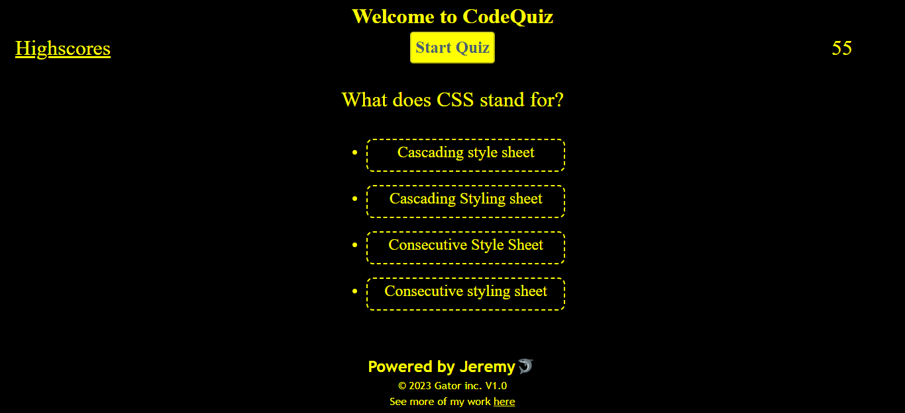

# CodeQuiz

## Table of Contents (Optional)

- [Description](#description)
- [Usage](#usage)
- [Link](#link)

## Description

This code create a quiz to test your knowledge and HTML, CSS and JavaScript.
When you answer wrong, time is deducted gfrom the timer. at the end of the quiz the time remaining on the timer is your score.

## Usage

To start the game, simply press "start quiz".
The user will be presented with a question and 4 answers only one of which is correct.
Simply click on the answer of your choice, if the answer is wrong you will lose 10sec on your counter.
The next question then appears and you can choose an answer again.
When the last question has been answered or if the timer reaches 0 before that, the user will be displayed with a input box.
All score are saved in the Highscore page, click on the link on the top left corner to see the other scores.

## Link

The link to the deployed application is:
 https://gator2-0.github.io/CodeQuiz/

